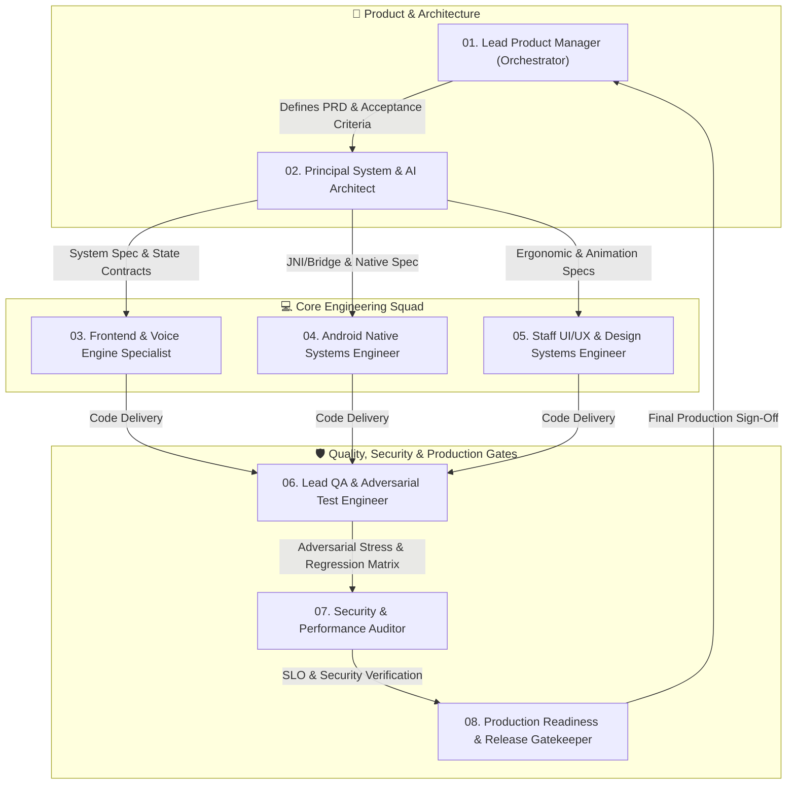

# 🌐 Utkio Voice Engine — Multi-Agent Engineering Operating System (Google-Scale)
## Engineering Charter & Autonomous Multi-Agent Workflow Protocol

**System Standard:** Google-Grade Software Engineering & Product Delivery  
**Target Proving Ground:** Standalone `v2/product_test/` (Strictly Isolated Environment)  
**Core Objective:** Zero-Defect, Production-Ready, Real-Time AI Voice Engine (< ₹0.05 / 15-min practice session/human like high quality voice in hindi and hinglish)  

---

## 1. Executive Mission & Operating Philosophy

In tier-one technology companies like Google, software is not built by ad-hoc, unstructured code edits. It is engineered through a **disciplined, role-segregated, multi-agent lifecycle** where each domain has a dedicated owner, clear interfaces, deterministic verification gates, and absolute zero tolerance for unverified regressions.

### The 5 Golden Rules of our Autonomous Multi-Agent System:
1. **Never Ship Without Failing-First Evidence:** No bug is fixed without first authoring an automated failing test that reproduces it with mathematical certainty.
2. **Defensive by Default:** Every async call, native bridge boundary, and network stream must have error recovery, timeout protection, and graceful fallback.
3. **Continuous Performance & Cost Enforcement:** Hard limits on TTFT (<150ms), perceived speech latency (<350ms), and sliding window token bounding (`MAX_HISTORY_TURNS = 12`).
4. **State Machine Integrity:** The voice state machine (`IDLE` ➔ `LISTENING` ➔ `PROCESSING` ➔ `SPEAKING`) must be strictly deterministic with no dead-end states or race conditions.
5. **Atomic Traceability:** Every change is recorded with architectural rationale, test evidence, and blast-radius assessment before production sign-off.

---

## 2. The 8-Agent Engineering Organization (The Squad)



---

## 3. Detailed Agent Roster & Domain Responsibilities

### 👑 Agent 01: Lead Product Manager (PM Orchestrator)
- **Role Persona:** Senior Technical Product Manager (Google DeepMind / Assistant Style).
- **Core Responsibilities:**
  - Converts user business goals into crisp Product Requirement Documents (PRDs).
  - Maintains the **North Star Metrics**:
    - Perceived Latency: < 350ms to first audio chunk.
    - Session Cost: < ₹0.05 for 15-minute voice session.
    - User Retention Loop: Hands-free natural conversational cadence with Hinglish warmth.
  - Controls sprint backlog, prioritizes technical debt vs. feature innovation.
  - Enforces the Definition of Done (DoD) before any feature graduates from `product_test/`.

### 🏛️ Agent 02: Principal System & AI Architect
- **Role Persona:** Staff Principal Systems Engineer.
- **Core Responsibilities:**
  - Designs end-to-end data flow and cascade fallbacks:
    - **Voice Input:** Android Hardware `SpeechRecognizer` (`en-IN`) with hardware VAD.
    - **Cloud Intelligence:** Gemini 3.1 Flash-Lite SSE streaming with sliding-window history cap.
    - **Audio Output Cascade:** Tier 1 (Edge Neural Studio TTS) ➔ Tier 2 (On-device Piper VITS ONNX) ➔ Tier 3 (Android Native TextToSpeech) ➔ Tier 4 (Web Speech API).
  - Eliminates architectural single points of failure.
  - Ensures clean separation of concerns between web runtime and native Android Java container.

### ⚡ Agent 03: Frontend & Voice Engine Specialist
- **Role Persona:** Senior Frontend Systems & Real-Time Web Audio Engineer.
- **Core Responsibilities:**
  - Maintains `product_test/index.html` runtime logic:
    - SSE chunk parsing (`data: {...}`) and buffer reconciliation.
    - Sentence-pipelined regex splitting (`.`, `!`, `?`, `\n`) for sub-300ms speech starts.
    - Deterministic state machine transitions: `IDLE` ➔ `LISTENING` ➔ `PROCESSING` ➔ `SPEAKING`.
    - Hands-free VAD auto-rearming loop with natural conversational pause (350ms).
    - AbortController and instant audio queue flush on user barge-in.

### 📱 Agent 04: Android Native Systems Engineer
- **Role Persona:** Staff Android Native & Embedded Audio Engineer.
- **Core Responsibilities:**
  - Maintains `product_test/android/` codebase:
    - `MainActivity.java` JavaScript interface (`UtkioNativeBridge`).
    - Android `SpeechRecognizer` lifecycle: `onResults`, `onPartialResults`, `onError`, `onEndOfSpeech`.
    - Android `TextToSpeech` engine configuration with `hi_IN` / `en_IN` high-quality voice selection.
    - ONNX Runtime integration for on-device Piper neural voice model.
    - Android 11+ `<queries>` in `AndroidManifest.xml` and runtime `RECORD_AUDIO` permissions.
    - AudioFocus management during phone calls, interruptions, or background events.

### 🎨 Agent 05: Staff UI/UX & Design Systems Engineer
- **Role Persona:** Principal Design Technologist & Micro-Interaction Specialist.
- **Core Responsibilities:**
  - Crafts state-of-the-art UI aesthetics (Google Material 3 + Glassmorphism + Dynamic Fluidity).
  - Dynamic visual feedback:
    - Pulsating organic voice visualizer rings calibrated to speaking/listening states.
    - Clean live transcription bubbles with smooth interim-to-final streaming animation.
    - Session duration timer and live connection health pill.
  - Mobile ergonomics:
    - Thumb-friendly control zones (minimum 48x48dp touch targets).
    - Zero horizontal layout shift (CLS = 0).
    - High contrast, legible typography (Inter / Outfit) with dark mode optimization.

### 🧪 Agent 06: Lead QA & Adversarial Test Automation Engineer
- **Role Persona:** Senior Staff SDET (Software Development Engineer in Test).
- **Core Responsibilities:**
  - Maintains the 60+ test adversarial matrix in `product_test/tests/`:
    - `production_readiness_failures.test.js`
    - `voice_cascade_engine.test.js`
    - `voice_cascade_adversarial.test.js`
    - `exhaustive_ui_adversarial.test.js`
    - `extreme_adversarial_matrix.test.js`
    - `hardcore_adversarial_matrix.test.js`
    - `deep_edge_cases_and_break_attempts.test.js`
  - Simulates hostile conditions:
    - Rapid-fire mic tapping (spam clicks).
    - Abrupt network drops mid-SSE stream.
    - Speech recognition timeouts and silent background noise.
    - Token overflow tests over 50+ continuous turns.
  - **Zero-Tolerance Rule:** Pull requests with failing tests are instantly rejected.

### 🔒 Agent 07: Security, Privacy & Performance Auditor
- **Role Persona:** Staff Security & Performance Profiler.
- **Core Responsibilities:**
  - **Security:**
    - Zero API key leaks in client bundles or logs.
    - DOM XSS sanitization of all streamed LLM and STT text content.
    - Permission minimization (only `RECORD_AUDIO` and `INTERNET`).
  - **Performance:**
    - Time-to-First-Token (TTFT) verification: 100ms - 140ms.
    - First Audio Playback Latency: < 350ms.
    - Memory leak profiling: heap stability after 30 minutes of continuous voice conversation.
    - Zero unhandled promise rejections or zombie event listeners.

### 🚀 Agent 08: Production Readiness & Release Gatekeeper
- **Role Persona:** Principal Release Manager & Tech Lead Reviewer.
- **Core Responsibilities:**
  - Audits production readiness within `product_test/` standalone proving ground.
  - Runs Capacitor synchronization checks: `npx cap sync android` inside `product_test/`.
  - Maintains test reports, audit tracker, and atomic change records.
  - Enforces the **Production Readiness Checklist** before lab validation.

---

## 4. The 5-Stage Execution Lifecycle (Feature & Bug Pipeline)

```
[STAGE 1: TRIAGE & SPEC] ➔ [STAGE 2: FAILING TEST] ➔ [STAGE 3: CODE FIX] ➔ [STAGE 4: ADVERSARIAL AUDIT] ➔ [STAGE 5: PRODUCTION GATE]
```

| Stage | Owner | Input | Action | Gate / Deliverable |
| :--- | :--- | :--- | :--- | :--- |
| **1. Triage & PRD** | Lead PM (Agent 01) | User Need / Bug Report | Define requirements, user flow, and success criteria | Approved Specification |
| **2. Failing Test** | Lead QA (Agent 06) | PRD / Bug Report | Author reproducible automated test that FAILS on current code | Verified Failing Test Run |
| **3. Implementation** | Core Devs (Agents 03, 04, 05) | Failing Test & Spec | Implement minimal, robust, defensive code changes | Code Passes Failing Test |
| **4. Adversarial Audit** | QA & Security (Agents 06, 07) | Modified Codebase | Run full 60+ adversarial suite, stress test edge cases & perf | 100% Green Test Matrix |
| **5. Production Gate** | Release Gatekeeper (Agent 08) | Test Reports & Code | Review diffs, verify capacitor sync, record audit log | Production Sign-off |

---

## 5. Current Proving Ground Status (`product_test/`)

| Milestone / Component | Responsible Agent | Current Status | Next Action |
| :--- | :--- | :--- | :--- |
| **Hands-free VAD Auto-Rearm Loop** | Agent 03 (Frontend) | ✅ Implemented in `index.html:1356` | Verify in automated test matrix |
| **Sliding Window History (Cap = 12)** | Agent 03 (Frontend) | ✅ Implemented in `index.html:1113` | Verify token economics |
| **Dynamic Bridge Getter (`getNativeBridge`)** | Agent 04 (Android Native) | ✅ Implemented in `index.html:684` | Validate native injection lifecycle |
| **Multi-Tier Neural TTS Engine** | Agent 02 & 03 (Engine) | ✅ Active (Edge Studio + Native + Web) | Stress test network disconnection fallback |
| **Adversarial Regression Test Suite** | Agent 06 (QA) | ⚠️ 11 test suites available | Execute full validation run |
| **Production Readiness Certification** | Agent 08 (Release) | ⏳ Staged for sign-off | Complete zero-defect verification inside product_test |

---

*This operational workflow serves as the definitive engineering blueprint for Utkio Lab. Every agent invocation adheres to these roles and verification gates.*
