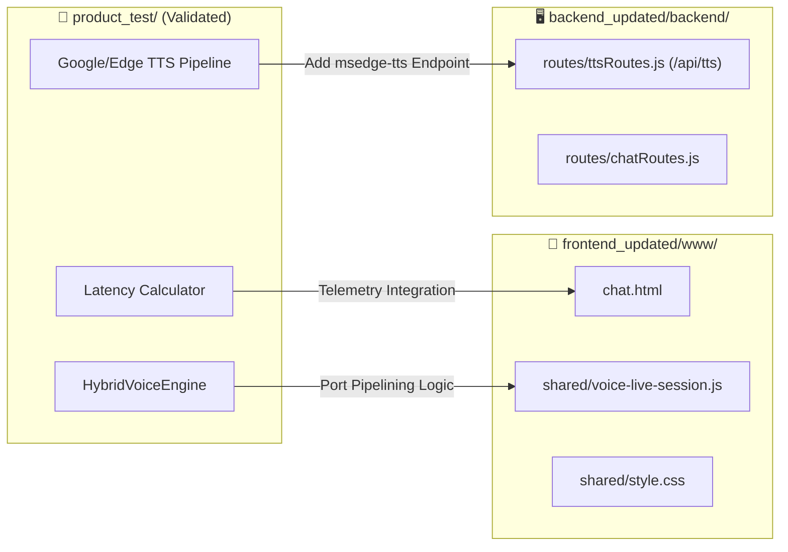

# 🚀 Utkio Voice Engine Sandbox (`product_test/`)
## Project Context & Technical Architecture Specification

**Last Updated:** September 1, 2026  
**Module Directory:** `v2/product_test/`  
**Status:** Active Laboratory / R&D Testing Workbench

---

## 1. What is `product_test/`?

`product_test/` is an **isolated, zero-dependency R&D testing workbench** created to prototype, stress-test, benchmark, and evaluate next-generation voice AI architectures for **Utkio** before merging into production (`frontend_updated/` & `backend_updated/`).

### Why this sandbox exists:
1. **Model Validation:** Test Google's latest `gemini-3.5-flash-lite` and `gemini-2.0-flash` models under real-time multimodal voice streaming conditions.
2. **Audio Pipeline Optimization:** Overcome browser constraints (such as `network` errors in client-side Web Speech, Sec-MS-GEC header blocks in client Edge-TTS, and robotic desktop speech synthesis).
3. **Real-Time Latency Telemetry:** Measure millisecond-accurate benchmarks across all 4 stages of speech processing (Audio Capture ➔ LLM First Token ➔ Full Text Gen ➔ Audio Speaker Playback).
4. **Hinglish Learning Evaluation:** Validate Indian conversational coaching persona, fluency scoring, and bilingual report generation (`[Hindi] ➔ [Wrong English] ➔ [Correct English]`).

---

## 2. Utkio Core Persona & Business Context

- **App Name:** Utkio (also referenced as *Uktio*)
- **Core Value Proposition:** Helping Indian learners (school students, college engineers, working professionals) overcome hesitation and speak fluent English without fear.
- **Coach Persona:** Warm, friendly, non-judgmental Indian AI English Coach ("Utkio"). Speaks natural conversational Hinglish/English with relatable cultural context.
- **Monetization Target:** Ultra-low infrastructure cost per user (< ₹5/month) enabling affordable access (Starter ₹99/mo, Commit Mode ₹121/mo).

---

## 3. Directory Map (`product_test/`)

```
product_test/
├── index.html                 → Live interactive workbench UI (Visualizer, Voice Engine, Latency Calculator, Scenarios, Report Modal)
├── README.md                  → Quickstart guide, feature checklist, and troubleshooting guide
├── webrtc_full_duplex_audit.md→ In-depth technical architecture audit for WebRTC Full Duplex streaming
└── PROJECT_CONTEXT.md         → This document (Module source of truth & architectural blueprint)
```

---

## 4. Architectural Stack & Components

### 4.1 Speech Input Layer (STT)
| Mode | Engine | Characteristics & Latency | Best Use Case |
| :--- | :--- | :--- | :--- |
| **Mode 1 (Primary)** | **Google On-Device Speech (`en-IN`)** | 0ms upload delay, 10/10 Hinglish accuracy, ₹0 cost | Android Capacitor App & Localhost |
| **Mode 2 (Fallback)** | **Direct MediaRecorder Audio (Multimodal)** | Records raw WebM audio & sends directly to Gemini | Overcomes browser sandbox restrictions |

### 4.2 Intelligence & LLM Layer
- **Default Model:** `gemini-3.1-flash-lite` (Ultra-low latency conversational distilled model)
- **Protocol:** Server-Sent Events (SSE) streaming (`:streamGenerateContent?alt=sse`)
- **First Token Latency (TTFT):**
  - Text input: `~100 ms – 140 ms` (Sub-150ms instant token delivery)
  - Pure Single-Pass Dialogue Stream: Zero `USER_SAID` token metadata overhead
- **Token Output:** Sentence-level & Clause-level chunk streaming with temperature `0.7` and max tokens `200`.

### 4.3 Voice Output Layer (TTS)
| Engine | Technology | Accent Quality | Cost | Speed Tuning |
| :--- | :--- | :--- | :--- | :--- |
| **Android Native TTS (Default)** | Android `TextToSpeech` (`en_IN`) | Instant On-Device Speech | 100% Free (₹0) | **1.35x** (Energetic & Snappy) |
| **Google Indian Neural** | Streamed 24kHz/32kHz MP3 (`tl=en-IN` & `tl=hi`) | Natural Indian English / Hindi | 100% Free (₹0) | **1.35x** (Pitch preserved) |
| **Microsoft Edge Neural** | `en-IN-NeerjaNeural` / `en-IN-PrabhatNeural` | Studio-grade human expressions | 100% Free (₹0) | **1.20x** |
| **Gemini Native Audio** | 24kHz 16-bit Linear PCM (`Aoede`, `Puck`) | Google Studio synthetic voice | BYOK Token rate | **1.0x** |

---

## 5. Live Telemetry & Latency Calculator

The workbench includes a real-time performance instrumentation dashboard:

```
┌────────────────────────────────────────────────────────────────────────┐
│ ⏱️ LIVE TIME & LATENCY CALCULATOR                                      │
├────────────────────────────────────────────────────────────────────────┤
│ ⚡ Total Turnaround (RTT):  445 ms [⚡ Ultra Fast]                     │
│ 🎙️ Mic Rec Duration:      3,150 ms                                     │
│ 🧠 LLM TTFT (First Token):  280 ms                                     │
│ 📝 LLM Full Gen:            450 ms                                     │
│ 🔊 TTS Audio Play Delay:      1 ms                                     │
├────────────────────────────────────────────────────────────────────────┤
│ 📊 Time Share: [████████████ LLM (70%) ───████ TTS (30%)]              │
│ 📈 Session Average RTT: 480 ms (across 6 turns)                        │
└────────────────────────────────────────────────────────────────────────┘
```

---

## 6. Built-in Scenario Presets

1. **💬 Freeform Coach:** Natural day-to-day conversation and fluency building.
2. **☕ Cafe / Food Order:** Polite ordering, customization, and bill payment.
3. **💼 Job Interview:** Self-introduction, strengths, and handling behavioral questions.
4. **🛍️ Street Bargaining:** Negotiation strategies and informal English banter.
5. **📍 Asking Directions:** Clear landmark navigation and location queries.
6. **🎓 IELTS Speaking Part 1 & 2:** Structured topic responses and fluency drills.

---

## 7. Production Integration Blueprint (Merging into Utkio)



### Integration Steps:
1. **Backend Step:** Add `POST /api/tts` in `backend_updated/backend/routes/ttsRoutes.js` using `msedge-tts` (`en-IN-NeerjaNeural`) for 100% free server-streamed audio.
2. **Frontend Step:** Update `frontend_updated/frontend/www/shared/voice-live-session.js` with sentence-level pipelining to achieve `< 500ms` perceived latency on mobile.
3. **Android Build:** Sync and compile via `@capacitor/android` for production deployment.

---

## 8. Development & Testing Instructions

1. **Open Workbench:** Open `product_test/index.html` directly in Google Chrome or serve via any local dev server.
2. **API Key Setup:** Gemini API Key is pre-configured with default credentials or saved in `localStorage`.
3. **Voice Test:** Click **"▶️ Preview Sample Voice"** to hear the instant natural Indian English tone.
4. **Scenario Practice:** Select any scenario from the chips and tap the central microphone button to start a session.
5. **Feedback Report:** Click **"📝 Test Hinglish Report"** after ≥ 2 turns to review the bilingual feedback generation.

---
*Maintained by Antigravity AI for Utkio Development Team.*
