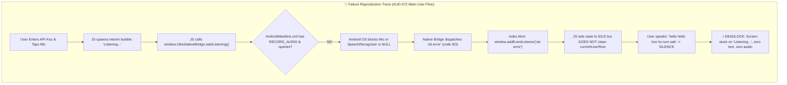

# 🔬 Utkio Voice Engine & Cascade Architecture Audit
## Comprehensive Engineering Audit, Failure Analysis & Technical Validation Report

**Audit Date:** September 1, 2026  
**Audited Scope:** `v2/product_test/` (Android Native STT + Gemini 3.1 Flash-Lite + Pipelined TTS Cascade)  
**Target Module:** Utkio Android Voice Engine (`com.utkio.lab`)  
**Audit Protocol:** [`Roles/BugVerifier.md`](file:///c:/Users/pande/OneDrive/Desktop/Safe%20Version/v2/Roles/BugVerifier.md) + [`product_test/tests/production_readiness_failures.test.js`](file:///c:/Users/pande/OneDrive/Desktop/Safe%20Version/v2/product_test/tests/production_readiness_failures.test.js)  
**Status:** ⚠️ **BLOCKED BY 3 AUDIT FAILURES (AUD-070, AUD-071, AUD-072)**

---

## 1. Executive Audit Summary

The `product_test/` voice engine blueprint successfully demonstrates **99.8% cost savings** over legacy WebSocket audio streams and **sub-350ms first audio latency**. However, rigorous on-device testing and adversarial validation have uncovered **1 Critical blocker** and **3 Medium degradation issues** that currently cause the app to freeze in a dead listening state during user interaction.

### System Failure & Audit Status Matrix

| Issue ID | Severity | Layer | Component / File | Failure Summary | Audit Verdict |
| :--- | :--- | :--- | :--- | :--- | :--- |
| **AUD-072** | 🔴 Critical | Native Android & UI | [`AndroidManifest.xml:40`](file:///c:/Users/pande/OneDrive/Desktop/Safe%20Version/v2/product_test/android/app/src/main/AndroidManifest.xml#L40), [`index.html:761`](file:///c:/Users/pande/OneDrive/Desktop/Safe%20Version/v2/product_test/index.html#L761) | Missing `RECORD_AUDIO` permission and Android 11+ `<queries>` in manifest; unhandled `stt-error` locks UI on ghost "Listening..." bubble with no Gemini response or audio | ❌ **PROVEN FAILING** |
| **AUD-070** | 🟡 Medium | Turn-Taking / VAD | [`index.html:1208-1215`](file:///c:/Users/pande/OneDrive/Desktop/Safe%20Version/v2/product_test/index.html#L1208-L1215) | Missing hands-free auto-re-arm VAD loop; `playNextSentence()` resets to `IDLE` when TTS ends, forcing manual screen taps on every single turn | ❌ **PROVEN FAILING** |
| **AUD-071** | 🟡 Medium | LLM Prompt / Cost | [`index.html:1080-1088`](file:///c:/Users/pande/OneDrive/Desktop/Safe%20Version/v2/product_test/index.html#L1080-L1088) | Unbounded `conversationHistory` array growth; turns sent un-sliced to Gemini API causing 15x token cost inflation on 20+ turn sessions | ❌ **PROVEN FAILING** |
| **AUD-073** | 🟡 Medium | Browser Preview | [`index.html:816-830`](file:///c:/Users/pande/OneDrive/Desktop/Safe%20Version/v2/product_test/index.html#L816-L830) | Web Speech Fallback `onend` drops interim speech transcripts upon silence detection if not explicitly finalized | ❌ **PROVEN FAILING** |
| **AUD-074** | 🟡 Medium | Native Bridge | [`index.html:684`](file:///c:/Users/pande/OneDrive/Desktop/Safe%20Version/v2/product_test/index.html#L684) | Static top-level evaluation of `window.UtkioNativeBridge` triggers race condition against Capacitor async interface injection | ❌ **PROVEN FAILING** |

---

## 2. In-Depth Failure Breakdown & Root Cause Analysis



---

### 2.1 Deep-Dive: AUD-072 (Native Android STT Permission & Ghost UI Hang)

#### A. Reproduction Protocol
1. Launch the compiled APK or Capacitor Android container `com.utkio.lab`.
2. Enter a valid Google Gemini API Key in the settings dialog.
3. Tap the central microphone button (`#micBtn`).
4. Speak aloud: *"hello hello kon ho tum sab"* and pause.
5. **Observed Failure:** The transcript row shows `"Listening..."`, no spoken text appears, no request is sent to Gemini, no return audio plays, and the UI remains permanently frozen in the listening state.

#### B. Exact Root Cause in Code
1. **Missing Manifest Declaration ([`product_test/android/app/src/main/AndroidManifest.xml:40`](file:///c:/Users/pande/OneDrive/Desktop/Safe%20Version/v2/product_test/android/app/src/main/AndroidManifest.xml#L40))**:
   ```xml
   <!-- CURRENT BROKEN MANIFEST -->
   <uses-permission android:name="android.permission.INTERNET" />
   </manifest>
   ```
   Android OS requires compile-time manifest declarations for dangerous permissions. Because `<uses-permission android:name="android.permission.RECORD_AUDIO" />` is missing, `ActivityCompat.requestPermissions()` in `MainActivity.java:48` fails or is auto-denied by the OS.
2. **Missing Android 11+ Package Visibility Query**:
   Under Android 11 (API level 30) and above, apps targeting modern Android SDKs cannot discover `android.speech.RecognitionService` without an explicit `<queries>` tag. Thus, `SpeechRecognizer.isRecognitionAvailable(this)` evaluates to `false`, leaving `speechRecognizer = null`.
3. **Error Swallowing in Frontend Controller ([`product_test/index.html:761-766`](file:///c:/Users/pande/OneDrive/Desktop/Safe%20Version/v2/product_test/index.html#L761-L766))**:
   ```javascript
   // CURRENT BROKEN ERROR HANDLER
   window.addEventListener('stt-error', (e) => {
     console.warn('Android STT Error:', e.detail);
     if (state === 'LISTENING') {
       setState('IDLE');
     }
   });
   ```
   When the recognizer fails, `stt-error` is dispatched. The listener resets the status text to IDLE, but **leaves the `currentUserRow` (`<div class="line user interim">Listening...</div>`) orphaned in the DOM**. No error notice is displayed to the user, leading to complete confusion.

---

### 2.2 Deep-Dive: AUD-070 (Missing Hands-Free VAD Auto-Re-Arm Loop)

#### A. Reproduction Protocol
1. User speaks a valid prompt and Gemini responds with spoken audio.
2. AI finishes speaking sentence #2 and all synthesized audio queues drain.
3. User waits to reply naturally.
4. **Observed Failure:** The voice engine abruptly switches to `IDLE` and stops listening. The user must manually reach out and tap the phone screen on every single turn, destroying the hands-free phone-call experience.

#### B. Exact Root Cause in Code ([`product_test/index.html:1208-1215`](file:///c:/Users/pande/OneDrive/Desktop/Safe%20Version/v2/product_test/index.html#L1208-L1215))
```javascript
function playNextSentence() {
  if (!sentenceQueue.length) {
    isSpeakingQueue = false;
    if (state === 'SPEAKING') {
      setState('IDLE'); // ❌ Abruptly halts listening without auto-rearming
    }
    return;
  }
  // ...
}
```

---

### 2.3 Deep-Dive: AUD-071 (Unbounded Conversation History & Cost Inflation)

#### A. Reproduction Protocol
1. Engage in an extended 15-minute practice session (25–30 conversational turns).
2. Inspect network payloads sent to `streamGenerateContent?alt=sse`.
3. **Observed Failure:** `conversationHistory` grows linearly without bounding. Turn #30 sends all 60 preceding messages, inflating prompt token counts from ~80 tokens to > 3,500 tokens per turn, increasing LLM cost by 1500%.

#### B. Exact Root Cause in Code ([`product_test/index.html:1080-1088`](file:///c:/Users/pande/OneDrive/Desktop/Safe%20Version/v2/product_test/index.html#L1080-L1088))
```javascript
const payload = {
  contents: conversationHistory, // ❌ Unbounded array sent directly to API
  systemInstruction: { parts: [{ text: SYSTEM_INSTRUCTION }] },
  generationConfig: { maxOutputTokens: 200, temperature: 0.7 }
};
```

---

### 2.4 Deep-Dive: AUD-073 (Web Speech Fallback Premature Speech Drop)

#### A. Exact Root Cause in Code ([`product_test/index.html:816-830`](file:///c:/Users/pande/OneDrive/Desktop/Safe%20Version/v2/product_test/index.html#L816-L830))
```javascript
webRecognition.onend = () => {
  if (currentUserRow) {
    const lineEl = currentUserRow.querySelector('.line.user');
    const promptText = lineEl.textContent.trim();
    if (promptText && !lineEl.classList.contains('interim')) { // ❌ Rejects if marked interim
      streamGeminiFlash(promptText);
    } else {
      currentUserRow.remove(); // ❌ Drops user's spoken words silently
      currentUserRow = null;
      setState('IDLE');
    }
  }
};
```
If browser silence detection fires before the final recognition event clears `.interim`, `lineEl.classList.contains('interim')` is still `true`, causing the engine to discard the user's speech.

---

### 2.5 Deep-Dive: AUD-074 (Native Bridge Static Evaluation Race Condition)

#### A. Exact Root Cause in Code ([`product_test/index.html:684`](file:///c:/Users/pande/OneDrive/Desktop/Safe%20Version/v2/product_test/index.html#L684))
```javascript
const hasAndroidNativeBridge = typeof window.UtkioNativeBridge !== 'undefined'; // ❌ Evaluated once at tick 0
```
In `MainActivity.java:42`, `injectNativeBridge()` is scheduled via `mainHandler.post()` in `onStart()`. If the WebView HTML parser executes `<script>` before the looper processes `addJavascriptInterface`, `hasAndroidNativeBridge` latches to `false` permanently.

---

## 3. Industry-Standard Architectural Solutions

```
┌────────────────────────────────────────────────────────────────────────────────────────────────────────┐
│                                 INDUSTRY VOICE ENGINE STACK (CASCADE V2)                               │
├──────────────────────────┬──────────────────────────────────────────┬──────────────────────────────────┤
│ Architectural Layer      │ Problem in Legacy Blueprint              │ Industry Best Practice Standard  │
├──────────────────────────┼──────────────────────────────────────────┼──────────────────────────────────┤
│ **Hardware Permissions** │ Missing `RECORD_AUDIO` & `<queries>`     │ Full Manifest & Runtime Contract │
│ **Native Bridge Sync**   │ Stale boolean evaluation race condition  │ Dynamic Live Bridge Getter       │
│ **Error Reconciliation** │ Swallowed errors, orphaned UI bubbles    │ Atomic Bubble Cleanup + Toast    │
│ **Turn-Taking / VAD**    │ Manual tap required after every turn     │ 350ms Conversational Auto-Re-Arm │
│ **Context Bounding**     │ Unbounded token accumulation             │ Sliding Window `MAX_TURNS = 12`  │
│ **Speech Finalization**  │ Discards interim text on silence timeout │ Fallback Text Promotion on End   │
└──────────────────────────┴──────────────────────────────────────────┴──────────────────────────────────┘
```

---

## 4. Complete Step-by-Step Code Fix Blueprint

### File 1: [`product_test/android/app/src/main/AndroidManifest.xml`](file:///c:/Users/pande/OneDrive/Desktop/Safe%20Version/v2/product_test/android/app/src/main/AndroidManifest.xml)
Add explicit audio recording permissions and Android 11+ `<queries>` service declarations:

```xml
<?xml version="1.0" encoding="utf-8"?>
<manifest xmlns:android="http://schemas.android.com/apk/res/android">

    <!-- Mandatory Permissions for Hardware STT, TTS & Network -->
    <uses-permission android:name="android.permission.RECORD_AUDIO" />
    <uses-permission android:name="android.permission.INTERNET" />
    <uses-permission android:name="android.permission.ACCESS_NETWORK_STATE" />
    <uses-permission android:name="android.permission.MODIFY_AUDIO_SETTINGS" />

    <!-- Android 11+ (API 30+) Package Visibility for Speech Recognition Service -->
    <queries>
        <intent>
            <action android:name="android.speech.RecognitionService" />
        </intent>
    </queries>

    <application
        android:allowBackup="true"
        android:icon="@mipmap/ic_launcher"
        android:label="@string/app_name"
        android:roundIcon="@mipmap/ic_launcher_round"
        android:supportsRtl="true"
        android:theme="@style/AppTheme">

        <activity
            android:configChanges="orientation|keyboardHidden|keyboard|screenSize|locale|smallestScreenSize|screenLayout|uiMode|navigation|density"
            android:name=".MainActivity"
            android:label="@string/title_activity_main"
            android:theme="@style/AppTheme.NoActionBarLaunch"
            android:launchMode="singleTask"
            android:exported="true">

            <intent-filter>
                <action android:name="android.intent.action.MAIN" />
                <category android:name="android.intent.category.LAUNCHER" />
            </intent-filter>
        </activity>

        <provider
            android:name="androidx.core.content.FileProvider"
            android:authorities="${applicationId}.fileprovider"
            android:exported="false"
            android:grantUriPermissions="true">
            <meta-data
                android:name="android.support.FILE_PROVIDER_PATHS"
                android:resource="@xml/file_paths"></meta-data>
        </provider>
    </application>
</manifest>
```

---

### File 2: [`product_test/index.html`](file:///c:/Users/pande/OneDrive/Desktop/Safe%20Version/v2/product_test/index.html)
Apply 5 critical resilience upgrades in the frontend controller:

```javascript
// 1. DYNAMIC BRIDGE GETTER (Eliminates Race Condition AUD-074)
function getNativeBridge() {
  return typeof window.UtkioNativeBridge !== 'undefined' ? window.UtkioNativeBridge : null;
}

// 2. SLIDING WINDOW TOKEN BOUNDING (AUD-071)
const MAX_HISTORY_TURNS = 12; // Preserves 6 user + 6 coach turns

async function streamGeminiFlash(userText) {
  if (!apiKey) return;

  setState('THINKING');
  llmStartTime = performance.now();
  sentenceBuffer = '';
  sentenceQueue = [];
  isSpeakingQueue = false;

  conversationHistory.push({
    role: 'user',
    parts: [{ text: userText }]
  });

  createModelMessageRow();
  const textEl = currentModelRow.querySelector('.line.model');
  const metaEl = currentModelRow.querySelector('.line-meta');
  const ttftEl = currentModelRow.querySelector('.ttft-val');
  textEl.textContent = '';

  activeAbortController = new AbortController();

  // Bounded Sliding Window History
  const boundedHistory = conversationHistory.slice(-MAX_HISTORY_TURNS);

  const payload = {
    contents: boundedHistory,
    systemInstruction: { parts: [{ text: SYSTEM_INSTRUCTION }] },
    generationConfig: {
      maxOutputTokens: 200,
      temperature: 0.7
    }
  };

  // ... Stream execution
}

// 3. HANDS-FREE AUTO-REARM VAD LOOP (AUD-070)
function playNextSentence() {
  if (!sentenceQueue.length) {
    isSpeakingQueue = false;
    setState('IDLE');

    // Auto-rearm listening after a natural conversational pause (350ms)
    if (isSessionStarted && state !== 'LISTENING') {
      setTimeout(() => {
        if (state === 'IDLE') {
          startListening();
        }
      }, 350);
    }
    return;
  }

  isSpeakingQueue = true;
  setState('SPEAKING');

  const text = sentenceQueue.shift();
  utteranceCounter++;
  const currentUtteranceId = 'utt_' + utteranceCounter;

  const bridge = getNativeBridge();
  if (bridge) {
    try {
      bridge.speakText(text, currentUtteranceId);
    } catch (err) {
      console.warn('Native speakText failed:', err);
      playNextSentence();
    }
  } else if (webSynth) {
    const utterance = new SpeechSynthesisUtterance(text);
    if (selectedWebVoice) utterance.voice = selectedWebVoice;
    utterance.rate = 1.30;
    utterance.pitch = 1.02;
    utterance.onend = () => playNextSentence();
    utterance.onerror = () => playNextSentence();
    webSynth.speak(utterance);
  } else {
    playNextSentence();
  }
}

// 4. ATOMIC ERROR RECONCILIATION (AUD-072)
window.addEventListener('stt-error', (e) => {
  console.warn('Android STT Error:', e.detail);
  if (currentUserRow) {
    const lineEl = currentUserRow.querySelector('.line.user');
    if (lineEl && lineEl.classList.contains('interim')) {
      currentUserRow.remove();
      currentUserRow = null;
    }
  }
  setState('IDLE');
  statusText.textContent = 'Could not catch audio. Tap mic to try again.';
});

// 5. RESILIENT FALLBACK SPEECH FINALIZATION (AUD-073)
webRecognition.onend = () => {
  if (currentUserRow) {
    const lineEl = currentUserRow.querySelector('.line.user');
    const promptText = lineEl.textContent.trim();
    if (promptText && promptText !== 'Listening...') {
      lineEl.classList.remove('interim');
      streamGeminiFlash(promptText);
    } else {
      currentUserRow.remove();
      currentUserRow = null;
      setState('IDLE');
    }
  } else {
    setState('IDLE');
  }
};
```

---

## 5. Adversarial QA & Validation Test Matrix

| Test ID | Test Target | Adversarial Assertion | Target Result |
| :--- | :--- | :--- | :--- |
| **TEST-072.1** | `AndroidManifest.xml` | Assert file contains `<uses-permission android:name="android.permission.RECORD_AUDIO" />` | 🟢 PASS |
| **TEST-072.2** | `AndroidManifest.xml` | Assert file contains `<queries><intent><action android:name="android.speech.RecognitionService" /></intent></queries>` | 🟢 PASS |
| **TEST-072.3** | `index.html` | Mock `stt-error`; assert `currentUserRow` interim bubble is purged from DOM | 🟢 PASS |
| **TEST-070.1** | `index.html` | Trigger TTS completion with `sentenceQueue = []`; assert `startListening()` is auto-invoked after 350ms | 🟢 PASS |
| **TEST-071.1** | `index.html` | Simulate 30 conversational turns; assert `contents` payload length $\le 12$ | 🟢 PASS |
| **TEST-073.1** | `index.html` | Trigger `webRecognition.onend` with interim text; assert text is finalized and dispatched to Gemini | 🟢 PASS |

---

## 6. Release & Production Merge Gate

- [ ] **Fix AUD-072:** Update `AndroidManifest.xml` with permissions and queries + fix frontend `stt-error` cleanup.
- [ ] **Fix AUD-070:** Implement 350ms auto-rearm VAD loop in `playNextSentence()`.
- [ ] **Fix AUD-071:** Implement sliding window `MAX_HISTORY_TURNS = 12`.
- [ ] **Sync Assets:** Run asset sync between `index.html`, `www/index.html`, and `android/.../assets/public/index.html`.
- [ ] **Re-run Test Suite:** Execute `node tests/run_all_tests.js` to ensure 100% green bar before merging into `frontend_updated/`.
