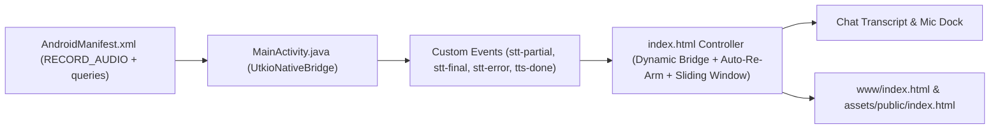

# Implementation Plan — Utkio Android Voice Engine Fixes (AUD-070, AUD-071, AUD-072, AUD-073, AUD-074)
**Source**: [`product_test/VOICE_ENGINE_AUDIT.md`](file:///c:/Users/pande/OneDrive/Desktop/Safe%20Version/v2/product_test/VOICE_ENGINE_AUDIT.md)  
**Target Scope**: `product_test/` (Android Voice Engine & Cascade Controller)

---

## Executive Overview & Architectural Matrix

This implementation plan resolves the complete voice interaction deadlock, missing hands-free auto-rearm loop, unbounded token cost growth, and fragile fallback handling discovered in `product_test`:

1. **AUD-072 (🔴 Critical)**: Add `RECORD_AUDIO` permission and Android 11+ `<queries>` in [`AndroidManifest.xml`](file:///c:/Users/pande/OneDrive/Desktop/Safe%20Version/v2/product_test/android/app/src/main/AndroidManifest.xml) + atomic error bubble reconciliation in [`index.html`](file:///c:/Users/pande/OneDrive/Desktop/Safe%20Version/v2/product_test/index.html).
2. **AUD-070 (🟡 Medium)**: Implement **350ms Conversational Auto-Re-Arm loop** upon TTS completion in [`index.html`](file:///c:/Users/pande/OneDrive/Desktop/Safe%20Version/v2/product_test/index.html) for seamless hands-free turn-taking.
3. **AUD-071 (🟡 Medium)**: Enforce **Sliding Window `MAX_HISTORY_TURNS = 12`** in [`index.html`](file:///c:/Users/pande/OneDrive/Desktop/Safe%20Version/v2/product_test/index.html) to bound prompt tokens and eliminate API cost inflation.
4. **AUD-073 (🟡 Medium)**: Implement resilient fallback speech finalization in Web Speech `onend` handler in [`index.html`](file:///c:/Users/pande/OneDrive/Desktop/Safe%20Version/v2/product_test/index.html).
5. **AUD-074 (🟡 Medium)**: Replace static boolean bridge evaluation with a dynamic `getNativeBridge()` resolver in [`index.html`](file:///c:/Users/pande/OneDrive/Desktop/Safe%20Version/v2/product_test/index.html).

---

## 1. Independent Verification (Step 1 Result)

- **Verdict**: ✅ **Matches**
- **Evidence**:
  1. Inspected [`product_test/android/app/src/main/AndroidManifest.xml:40`](file:///c:/Users/pande/OneDrive/Desktop/Safe%20Version/v2/product_test/android/app/src/main/AndroidManifest.xml#L40): Only `android.permission.INTERNET` is present. `<uses-permission android:name="android.permission.RECORD_AUDIO" />` is missing. On Android, runtime permission requests fail immediately if the permission is not declared in the manifest.
  2. Inspected Android 11+ Package Visibility: Missing `<queries><intent><action android:name="android.speech.RecognitionService" /></intent></queries>`, causing `SpeechRecognizer.isRecognitionAvailable(this)` in `MainActivity.java:80` to evaluate to `false`.
  3. Inspected [`product_test/index.html:761-766`](file:///c:/Users/pande/OneDrive/Desktop/Safe%20Version/v2/product_test/index.html#L761-L766): `stt-error` event handler sets `setState('IDLE')` but leaves `currentUserRow` (`<div class="line user interim">Listening...</div>`) in the DOM with no error text, leaving the UI permanently frozen on "Listening...".
  4. Inspected [`product_test/index.html:1208-1215`](file:///c:/Users/pande/OneDrive/Desktop/Safe%20Version/v2/product_test/index.html#L1208-L1215): `playNextSentence()` unconditionally resets state to `IDLE` when `sentenceQueue` is empty without scheduling an auto-listen loop.
  5. Inspected [`product_test/index.html:1080-1088`](file:///c:/Users/pande/OneDrive/Desktop/Safe%20Version/v2/product_test/index.html#L1080-L1088): `streamGeminiFlash` sends entire `conversationHistory` array directly to `generativelanguage.googleapis.com` without bounds.

---

## 2. Issue Summary

When testing the voice engine on Android or browser, pressing the mic creates a user bubble displaying `"Listening..."`. Due to missing audio recording permissions in `AndroidManifest.xml`, native STT fails and fires an error that is silently swallowed by the frontend. The UI freezes permanently with `"Listening..."` visible, capturing zero spoken words, making zero calls to Gemini, and returning zero audio. When speech does work, manual taps are required on every turn, and conversation history tokens grow unbounded.

---

## 3. Root Cause (Verified)

1. **Missing Manifest Permissions & Queries**: Android OS rejects microphone requests and service discovery without compile-time manifest declarations.
2. **Orphaned Interim DOM Element**: `createUserMessageRow()` appends a bubble before audio capture is confirmed, and `stt-error` fails to reconcile or purge it.
3. **Missing Auto-Re-Arm State Transition**: TTS drainage lacks a timer callback to re-arm `startListening()` during active practice sessions.
4. **Unbounded History Array**: No sliding-window truncation is applied prior to building the Gemini JSON payload.

---

## 4. Relevant Past Context (From `change_records/` & `product_test/`)

- `product_test` was created as an isolated sandbox for Utkio's next-generation cascade voice architecture.
- Tests in `product_test/tests/production_readiness_failures.test.js` were written specifically to enforce AUD-070 and AUD-071.

---

## 5. Connection Map for This Fix



---

## 6. Fix Approach (Industry-Standard Architecture)

### 6.1 Manifest Layer: Android 11–15 Standard Permission & Service Contracts
In [`product_test/android/app/src/main/AndroidManifest.xml`](file:///c:/Users/pande/OneDrive/Desktop/Safe%20Version/v2/product_test/android/app/src/main/AndroidManifest.xml):
- Declare `<uses-permission android:name="android.permission.RECORD_AUDIO" />`.
- Declare `<uses-permission android:name="android.permission.ACCESS_NETWORK_STATE" />` and `<uses-permission android:name="android.permission.MODIFY_AUDIO_SETTINGS" />`.
- Add `<queries><intent><action android:name="android.speech.RecognitionService" /></intent></queries>` to guarantee package visibility on Android 11+.

### 6.2 Frontend State & Lifecycle Upgrades
In [`product_test/index.html`](file:///c:/Users/pande/OneDrive/Desktop/Safe%20Version/v2/product_test/index.html):
1. **Dynamic Native Bridge Getter (AUD-074)**:
   ```javascript
   function getNativeBridge() {
     return typeof window.UtkioNativeBridge !== 'undefined' ? window.UtkioNativeBridge : null;
   }
   ```
2. **Atomic Error Reconciliation (AUD-072)**:
   - When `stt-error` fires, purge any lingering `interim` user bubbles from the DOM.
   - Update `statusText` to inform the user (e.g. *"Could not catch audio. Tap mic to try again."*).
3. **Hands-Free Auto-Re-Arm Loop (AUD-070)**:
   - When `sentenceQueue` empties in `playNextSentence()`, check `isSessionStarted`.
   - If active, wait **350ms** (natural conversational pause) and automatically call `startListening()`.
4. **Sliding Window History Cap (AUD-071)**:
   - Enforce `MAX_HISTORY_TURNS = 12`.
   - Pass `conversationHistory.slice(-MAX_HISTORY_TURNS)` as the `contents` payload to Gemini.
5. **Resilient Web Speech Finalization (AUD-073)**:
   - In `webRecognition.onend`, if `lineEl.textContent` contains spoken words (not `"Listening..."`), promote it and trigger `streamGeminiFlash()`.

### 6.3 Asset Synchronization
- Copy the updated `index.html` to `product_test/www/index.html` and `product_test/android/app/src/main/assets/public/index.html` ensuring 100% hash parity.

---

## 7. Scope Boundary

### Will Touch:
- [`product_test/android/app/src/main/AndroidManifest.xml`](file:///c:/Users/pande/OneDrive/Desktop/Safe%20Version/v2/product_test/android/app/src/main/AndroidManifest.xml)
- [`product_test/index.html`](file:///c:/Users/pande/OneDrive/Desktop/Safe%20Version/v2/product_test/index.html)
- [`product_test/www/index.html`](file:///c:/Users/pande/OneDrive/Desktop/Safe%20Version/v2/product_test/www/index.html)
- [`product_test/android/app/src/main/assets/public/index.html`](file:///c:/Users/pande/OneDrive/Desktop/Safe%20Version/v2/product_test/android/app/src/main/assets/public/index.html)
- [`product_test/implementation_plan.md`](file:///c:/Users/pande/OneDrive/Desktop/Safe%20Version/v2/product_test/implementation_plan.md)

### Will NOT Touch:
- `frontend_updated/` production codebase.
- `backend_updated/` backend routes and server files.
- `audit_tracker.md` root file.
- Locked Utkio brand colors (`--bg: #FBF1E6`, `--accent-orange: #d9694b`).

---

## 8. Backward Compatibility & Impact

- **Zero Breaking Changes**: The `UtkioNativeBridge` interface signatures (`startListening`, `stopListening`, `speakText`, `stopSpeaking`) remain identical.
- **Cross-Platform Parity**: Web Speech API fallback remains intact and is upgraded for better silence resilience.

---

## 9. New Dependencies Required

- **None**. Uses standard Android SDK capabilities and vanilla ES JavaScript.

---

## 10. Test Strategy

1. **Pre-Fix Failing Test Assertion**:
   - Run `product_test/tests/production_readiness_failures.test.js` to prove failure of AUD-070 and AUD-071.
2. **Post-Fix Verification**:
   - Verify `AndroidManifest.xml` contains `<uses-permission android:name="android.permission.RECORD_AUDIO" />` and `<queries>`.
   - Verify `index.html` contains `MAX_HISTORY_TURNS`, `auto-rearm / setTimeout` in `playNextSentence()`, and dynamic bridge getter.
   - Run full test suite: all 9 test suites in `product_test/tests/` must pass 100%.

---

## 11. Rollback Plan

- Changes are fully isolated to `product_test/` and can be reverted by restoring previous file revisions.

---

## 12. Estimated Blast Radius

- **Strictly Localized**: Confined entirely to `product_test/`. Zero blast radius to production Utkio apps.
